# 参考资料
## 参考书目
- [R for Data Science](https://r4ds.had.co.nz/)
- [ggplot2: Elegant Graphics for Data Analysis](https://ggplot2-book.org/)
- [Advanced R](https://adv-r.hadley.nz/)
- [R Packages](https://r-pkgs.org/)
- [现代统计图形](https://bookdown.org/xiangyun/msg/)
- [数据科学中的 R 语言](https://bookdown.org/wangminjie/R4DS/)
- [R语言教程](https://www.math.pku.edu.cn/teachers/lidf/docs/Rbook/html/_Rbook/index.html)

## R blogger主页
- [Hadley Wickham](http://hadley.nz/)
- [谢益辉](https://yihui.org/)
- [黄湘云](https://xiangyun.rbind.io/)

# 基本介绍
## R语言的历史
[The History of R (updated for 2020)](https://blog.revolutionanalytics.com/2020/07/the-history-of-r-updated-for-2020.html)

- 1992: R development begins as a research project in Auckland, NZ by Robert Gentleman and Ross Ihaka 
- 1993: First binary versions of R published at Statlib
- 1995: R first distributed as open-source software, under GPL2 license
- 1997: R core group formed
- 1997: CRAN founded (by Kurt Hornik and Fritz Leisch)
- 1999: The R website, r-project.org, founded
- 1999: First in-person meeting of R Core team, at inaugural Directions in Statistical Computing conference, Vienna
- 2000: R 1.0.0 released (February 29) 
- 2000: John Chambers, recipient of the 1998 ACM Software Systems Award for the S language, joins R Core
- 2001: R News founded (later to become the R Journal)
- 2003: R Foundation founded
- 2004: First UseR! conference (in Vienna)
- 2004: R 2.0.0 released
- 2009: First edition of the R Journal
- 2013: R 3.0.0 released
- 2015: R Consortium founded, with R Foundation participation
- 2016: New R logo adopted
- 2017: CRAN exceeds 10,000 published packages
- 2020: R 4.0.0 released

## R语言，你值得拥有
- R 是一个统计编程语言 (statistical programming)
- R 拥有顶尖水准的制图功能
- R 是**免费的**
- R 应用广泛，拥有丰富的库包，活跃的社区
- 统计学研究者的**重要工具**！

2019 年 8 月，国际统计学年会将考普斯总统奖（The Committee of Presidents of Statistical Societies Awards，简称 COPSS 奖，被誉为统计学的诺贝尔奖）奖颁给 tidyverse的作者Hadley Wickham后，充分说明R语言得到了学术界的肯定和认可，未来一片光明！

[Hadley Wickham's Homepage](http://hadley.nz/)，改变了R语言的人！


## 为什么要可视化？
- 看图片，往往能比表格传达出更多的信息，一图胜千言
- 可视化，“一半是科学、一半是艺术”。要做图，更要做漂亮的图
- 但可视化只是一种手段，根据数据实际情况作展示才是重要的，并不是要追求酷炫，适合自己的才是最好的

## 主要介绍内容
- R base：graphic
- Advanced：[ggplot2](https://ggplot2-book.org/)
- 交互图：plotly

# 基础做图
## 直方图
直方图（Histogram）是展示连续数据分布最常用的工具，它本质上是对密度函数的一种估计。

```r
library(formatR)
usage(hist.default)
```

```
## ## Default S3 method:
## hist(x, breaks = "Sturges", freq = NULL, probability = !freq,
##     include.lowest = TRUE, right = TRUE, density = NULL, angle = 45,
##     col = "lightgray", border = NULL, main = paste("Histogram of", xname),
##     xlim = range(breaks), ylim = NULL, xlab = xname, ylab, axes = TRUE,
##     plot = TRUE, labels = FALSE, nclass = NULL, warn.unused = TRUE, ...)
```
- x 为欲估计分布的数值向量
- breaks 决定了计算分段区间的方法，它可以是一个向量（依次给出区间端点），或者一个数字（决定拆分为多少段），或者一个字符串（给出计算划分区间的算法名称），或者一个函数（给出划分区间个数的方法），区间的划分直接决定了直方图的形状，因此这个参数是非常关键的
- freq 和 probability 参数均取逻辑值（二者互斥），前者决定是否以频数作图，后者决定是否以概率密度作图（这种情况下矩形面积为 1）
- labels 为逻辑值，决定是否将频数的数值添加到矩形条的上方

我们以黄石国家公园喷泉数据 geyser 为例, 展示了喷泉喷发间隔时间的分布情况。

```r
par(mfrow = c(3, 2))
data(geyser, package = "MASS")
hist(geyser$waiting, main = "(1) freq = TRUE", xlab = "waiting")
hist(geyser$waiting, freq = FALSE, xlab = "waiting", main = "(2) freq = FALSE")
hist(geyser$waiting, breaks = 5, density = 10, labels = TRUE, xlab = "waiting", main = "(3) breaks = 5")
hist(geyser$waiting, breaks = 40, col = "red", xlab = "waiting", main = "(4) breaks = 40")
hist(geyser$waiting, 
     breaks = quantile(geyser$waiting, probs = seq(0, 1, 0.1)), 
     border = "blue", xlab = "waiting", main = "(5) breaks by quantile")
```

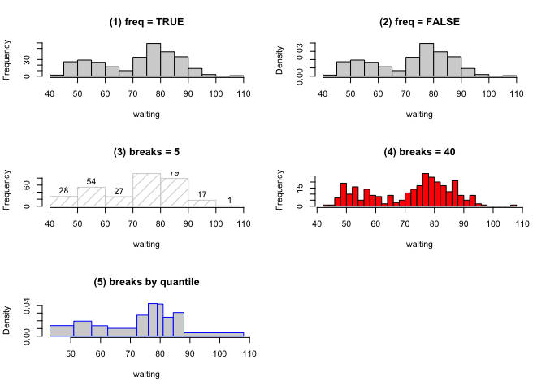<!-- -->

直方图与密度曲线的结合：借助函数 `density()` 可以计算出数据的核密度估计

```r
hist(geyser$waiting, probability = TRUE, main = "", xlab = "waiting")
d <- density(geyser$waiting)
lines(d) # 添加密度曲线
polygon(c(min(d$x), d$x, max(d$x)), c(0, d$y, 0), col = "lightgray", border = NA) # 填充颜色
yend <- c(); brk <- seq(40, 110, 5)
for (i in brk) {yend <- c(yend, d$y[which.min(abs(d$x - i))])}
segments(brk, 0, brk, yend, lty = 3) # 在点对之间画线段
```

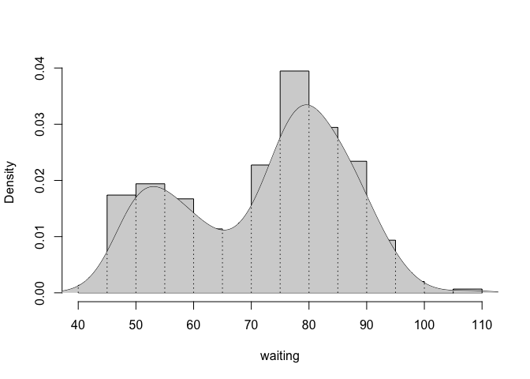<!-- -->

## 散点图
散点图通常用来展示两个变量之间的关系，这种关系可能是线性或非线性的。图中每一个点的横纵坐标都分别对应两个变量各自的观测值，因此散点所反映出来的趋势也就是两个变量之间的关系。


```r
usage(plot.default)
```

```
## ## Default S3 method:
## plot(x, y = NULL, type = "p", xlim = NULL, ylim = NULL, log = "", main = NULL,
##     sub = NULL, xlab = NULL, ylab = NULL, ann = par("ann"), axes = TRUE,
##     frame.plot = axes, panel.first = NULL, panel.last = NULL, asp = NA,
##     xgap.axis = NA, ygap.axis = NA, ...)
```

接下来展示人造数据的散点图：共 2 万个样本，其中有 1 万个样本点来自于两个独立的标准正态分布，另 1 万个样本点的坐标落在半径为 0.5 的圆上，最后将这 2 万个样本拼起来并打乱顺序。

```r
data(BinormCircle, package = "MSG")
par(pch = 20, ann = FALSE, mar = rep(.05, 4))
plot(BinormCircle, col = rgb(1, 0, 0), axes = FALSE)
box()
```

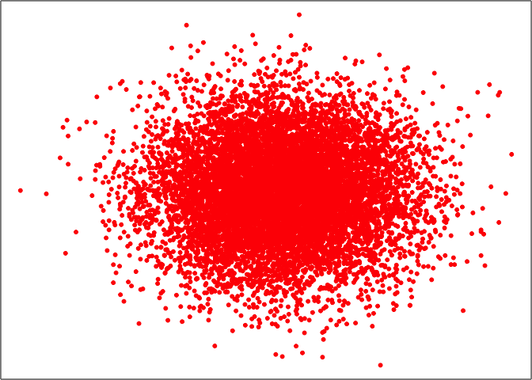<!-- -->

虽然数据只有两个变量，但我们用普通的统计模型和数值分析几乎无法找出数据的特征，如何解决呢？

```r
par(mfrow = c(2, 2), pch = 20, ann = FALSE, mar = rep(.05, 4))
# 转换颜色透明度 (alpha = 0.1)
plot(BinormCircle, col = rgb(1, 0, 0, 0.03), axes = FALSE)
# 限制坐标范围
plot(BinormCircle, col = rgb(1, 0, 0), xlim = c(-1, 1), ylim = c(-1, 1), axes = FALSE)
# 小符号
plot(BinormCircle, col = rgb(1, 0, 0), pch = ".", axes = FALSE)
# 绘制子集的散点图
plot(BinormCircle[sample(nrow(BinormCircle), 1000), ], col = rgb(1, 0, 0), axes = FALSE)
```

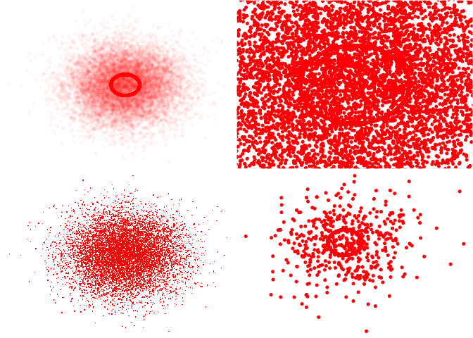<!-- -->

## 平滑散点图
平滑散点图的基础是散点图，但它并不直接将散点画出来，而是基于**二维核密度估计**用特定颜色深浅表示某个位置的密度值大小，默认颜色越深说明二维密度值越大，即该处数据点越密集。二维核密度估计的原理和一维情况类似：一维核密度估计是在直线上按照距离远近对每个数据点加权，距离越近则对密度值贡献越大，因此数据点密集的地方的核密度值也相应大，二维情况下只是距离的计算放到了平面上，加权思想相同。

由于平滑散点图大致保留了原始数据点的位置，因此两个变量之间的关系仍然可以从图中看出来，这一点和普通的散点图类似。平滑散点图进一步的优势在于它同时还显示了二维变量的密度，从密度中我们也许可以观察到局部的聚类现象（大块的深色）。


```r
par(mar = c(4, 4, 0.3, 0.1))
smoothScatter(BinormCircle, xlab = "", ylab = "")
```

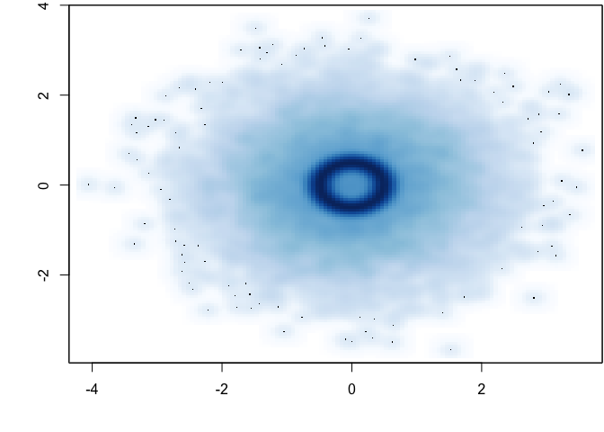<!-- -->

## 散点图矩阵
散点图矩阵（Scatterplot Matrices）是散点图的高维扩展，它的基本构成是普通散点图，只是将多个变量的两两散点图以矩阵的形式排列起来，就构成了所谓的散点图矩阵，它通常包含 $p\times p$ 个窗格（$p$ 为变量个数）。散点图矩阵从一定程度上克服了在平面上展示高维数据的困难，对于我们查看变量之间的**两两关系**非常有用。


```r
usage(pairs.default)
```

```
## ## Default S3 method:
## pairs(x, labels, panel = points, ..., horInd = 1:nc, verInd = 1:nc,
##     lower.panel = panel, upper.panel = panel, diag.panel = NULL,
##     text.panel = textPanel, label.pos = 0.5 + has.diag/3, line.main = 3,
##     cex.labels = NULL, font.labels = 1, row1attop = TRUE, gap = 1, log = "",
##     horOdd = !row1attop, verOdd = !row1attop)
```

```r
usage(graphics:::pairs.formula)
```

```
## ## S3 method for class 'formula'
## pairs(formula, data = NULL, ..., subset, na.action = stats::na.pass)
```

- `x` 是一个矩阵或数据框，包含了要作散点图的那些变量
- `labels` 是变量名称（标签）
- `panel` 参数给定一个画散点图的函数，这个函数将应用在每一格图形中；有时候我们并不需要统一的散点图函数，这时可以利用 `lower.panel` 和 `upper.panel` 来分别指定上三角窗格和下三角窗格中的作图函数，也就意味着上三角和下三角窗格中的图形（不一定非得是散点图）可以不一样
- `diag.panel` 和 `text.panel` 分别指定对角线窗格上的作图函数和添加文本标签的函数
- `label.pos` 指定文本标签的位置
- `cex.labels` 指定标签的缩放倍数
- `font.labels` 指定标签的字体样式
- `row1attop` 为逻辑值，指定散点图的第 1 行出现在顶部还是底部（按常规讲，前者是矩阵的形式，后者是图的形式，因为矩阵通常是从上至下、从左至右，而图的坐标是从下至上、从左至右）
- `gap` 设定窗格之间的间距大小。

对鸢尾花数据 `iris` 所作的散点图矩阵，注意其中的上三角和下三角作图函数是如何定义的。


```r
data(iris)
par(bg="gray")
pairs(iris[1:4], main = "Edgar Anderson's Iris Data", font.main = 4, pch = 19)
```

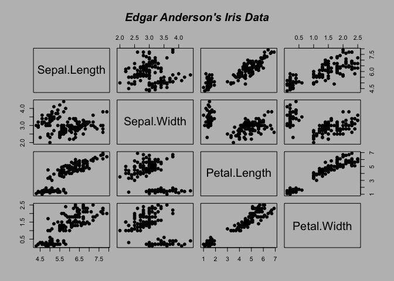<!-- -->

```r
pairs(iris[1:4], main = "Edgar Anderson's Iris Data", pch = 21, 
      bg = c("red", "green3", "blue")[iris$Species])
```

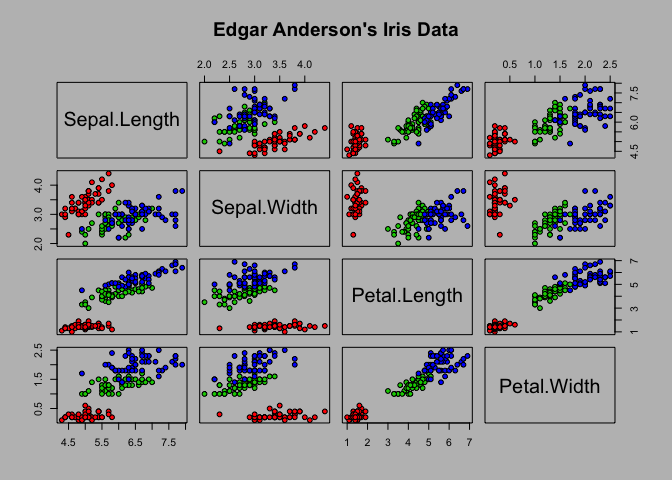<!-- -->


```r
## 观察如何使用 hist() 做计算并用 rect() 画图
panel.hist <- function(x, ...) {
  usr <- par("usr")
  on.exit(par(usr))
  par(usr = c(usr[1:2], 0, 1.5))
  h <- hist(x, plot = FALSE)
  nB <- length(breaks <- h$breaks)
  y <- h$counts / max(h$counts)
  rect(breaks[-nB], 0, breaks[-1], y, col = "beige") # 用给定的坐标、填充和边框颜色绘制一个矩形(或一系列矩形)
}

## 主对角线直方图
idx <- as.integer(iris$Species)
pairs(iris[1:4],
      upper.panel = function(x, y, ...) {
        points(x, y, pch = c(17, 16, 6)[idx], col = idx)
      },
      pch = 20, oma = c(2, 2, 2, 2),
      lower.panel = panel.smooth, diag.panel = panel.hist)
```

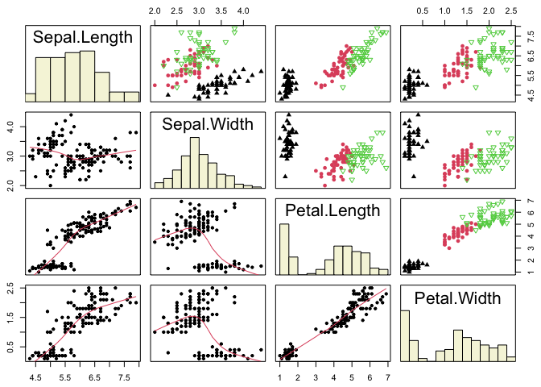<!-- -->

我们可以看到，主对角线上用了直方图，从中我们可以看到四个变量各自的分布情况；上三角窗格中用不同样式的点标记出了鸢尾花的不同类型；下三角窗格中简化了点的样式，但是利用函数 `panel.smooth()` 添加了一条平滑曲线，对鸢尾花的四个变量两两之间的关系作出了一种非参数概括。


```r
## 下三角放置相关系数图
panel.cor <- function(x, y, ...){
  par(usr = c(0, 1, 0, 1))
  txt <- as.character(format(cor(x, y), digits = 2))  # 求相关系数，并保留两位小数
  text(0.5, 0.5, txt, cex = 4*abs(cor(x, y))) # 设置字号，cex越大，则数字越大
}

pairs(iris[1:4],
      upper.panel = function(x, y, ...) {
        points(x, y, pch = c(17, 16, 6)[idx], col = idx)
      },
      pch = 20, oma = c(2, 2, 2, 2),
      lower.panel = panel.cor, diag.panel = panel.hist)

plot(iris[1:4],
      upper.panel = function(x, y, ...) {
        points(x, y, pch = c(17, 16, 6)[idx], col = idx)
      },
      pch = 20, oma = c(2, 2, 2, 2),
      lower.panel = panel.cor, diag.panel = panel.hist)
```

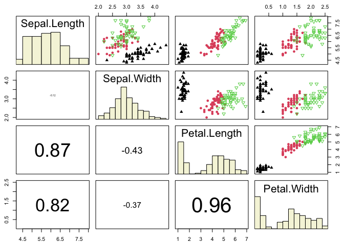<!-- -->


```r
panel.bxp <- function(x, ...) {
  usr <- par("usr")
  on.exit(par(usr))
  par(usr = c(0, 4, usr[3:4]))
  boxplot(x ~ iris$Species, col = "red", pch = 17, add=TRUE)
}

## 主对角线箱线图
idx <- as.integer(iris$Species)
pairs(iris[1:4],
      upper.panel = function(x, y, ...) {
        points(x, y, pch = c(17, 16, 6)[idx], col = idx)
      },
      pch = 20, oma = c(2, 2, 2, 2),
      lower.panel = panel.smooth, diag.panel = panel.bxp)
```

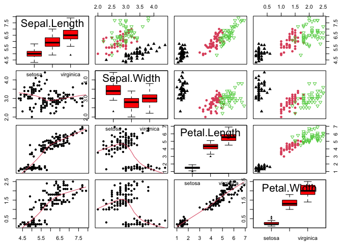<!-- -->


```r
library(ade4)
par(mar = c(0, 1, 0, 1))
panel.pane <- function(x, y, ...) {
  df <- cbind.data.frame(x, y)
  s.class(df, iris$Species, include.origin = FALSE, add.plot = TRUE, clabel = 1.5,
          col = c("blue", "black", "red"), cpoint = 2, cstar = 0.5)
}
pairs(iris[1:4], panel = panel.pane)
```

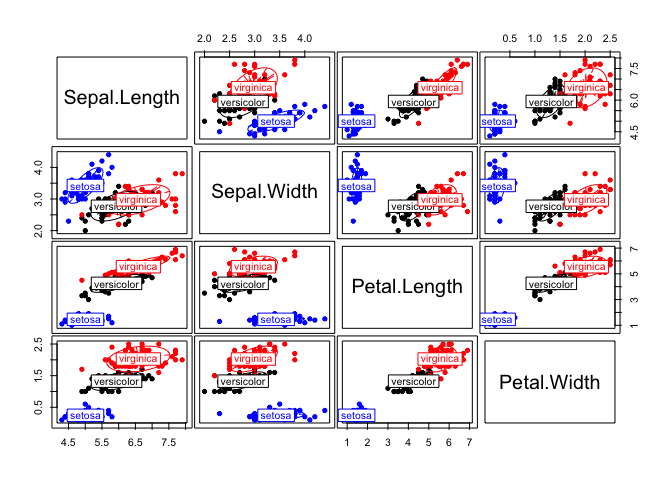<!-- -->

> 在变量数目较多时，我们不妨将散点图矩阵作为一种探索变量之间相关关系的工具，它比起相关系数矩阵等统计指标来优势在于：散点图矩阵展示了所有原始数据，这样我们可以看到变量之间的任何关系（线性或非线性、离群点），从而避免被单一的统计指标所误导。

## 箱线图
箱线图（Box Plot 或 Box-and-Whisker Plot）主要是从四分位数的角度出发
描述数据的分布，它通过最大值（$Q_4$）、上四分位数（$Q_3$）、中位数（$Q_2$）、下四分位数（$Q_1$）和最小值（$Q_0$）五处位置来获取一维数据的分布概况。我们知道，这五处位置之间依次包含了四段数据，每段中数据量均为总数据量的 $1/4$。通过每一段数据占据的长度，我们可以大致推断出数据的集中或离散趋势（长度越短，说明数据在该区间上越密集，反之则稀疏）。

因为 `boxplot()` 是一个泛型函数，所以它可以适应不同的参数类型。目前它支持两种参数类型：公式（ `formula` ）和数据，后者对我们来说可能更容易理解（给一批数据、作相应的箱线图），而前者在某些情况下更为方便，后面我们会举例说明。


```r
# 默认用法
usage(boxplot.default)
```

```
## ## Default S3 method:
## boxplot(x, ..., range = 1.5, width = NULL, varwidth = FALSE, notch = FALSE,
##     outline = TRUE, names, plot = TRUE, border = par("fg"), col = "lightgray",
##     log = "", pars = list(boxwex = 0.8, staplewex = 0.5, outwex = 0.5),
##     ann = !add, horizontal = FALSE, add = FALSE, at = NULL)
```

- 参数 `x` 为一个数值向量或者列表，若为列表则对列表中每一个子对象依次作出箱线图
- `range` 是一个延伸倍数，决定了箱线图的末端（须）延伸到什么位置，这主要是考虑到离群点的原因，在数据中存在离群点的情况下，将箱线图末端直接延伸到最大值和最小值对描述数据分布来说并不合适（图形缺乏稳健性），所以 R 中的箱线图默认只将图形延伸到离箱子两端 $\mathrm{range}\times(Q_3-Q_1)$ 处，即上下四分位数分别加/减内四分位距（Interquartile
Range，简称 $\text{IQR}\equiv Q_3-Q_1$）的倍数，超过这个范围的数据点就被视作离群点，在图中直接以点的形式表示出来
- `width`  给定箱子的宽度
- `varwidth` 为逻辑值，若为 `TRUE`，那么箱子的宽度与样本量的平方根成比例，这在多批数据同时画多个箱线图时比较有用，能进一步反映出样本量的大小
- `notch` 也是一个有用的逻辑参数，它决定了是否在箱子上画凹槽，凹槽所表示的实际上是中位数的一个区间估计，其计算式为 $Q_2+/-1.58\mathrm{IQR}/\sqrt{n}$，区间置信水平为 95%，在比较两组数据中位数差异时，我们只需要观察箱线图的凹槽是否有重叠部分，若两个凹槽互不交叠，那么说明这两组数据的中位数有显著差异（$p$值小于 0.05）
- `horizontal` 为逻辑值，设定箱线图是否水平放置
- `add` 设置是否将箱线图添加到现有图形上


```r
# 公式用法
usage(graphics:::boxplot.formula)
```

```
## ## S3 method for class 'formula'
## boxplot(formula, data = NULL, ..., subset, na.action = NULL,
##     xlab = mklab(y_var = horizontal), ylab = mklab(y_var = !horizontal),
##     add = FALSE, ann = !add, horizontal = FALSE, drop = FALSE, sep = ".",
##     lex.order = FALSE)
```

以一个模拟数据的例子展示箱线图凹槽的功能。这里我们分别从正态分布 $\mathrm{N}(0, 1)$ 和 $\mathrm{N}(0.8, 1)$ 中各自产生 150 和 50 个随机数，然后作箱线图比较两组数据中间位置的差异。图中的凹槽表明了两组数据的中位数有显著差异此外，该图还使用了 `varwidth` 参数以表明两组数据样本量的大小不同。


```r
x <- rnorm(150)
y <- rnorm(50, 0.8)
boxplot(list(x, y),
  names = c("x", "y"), horizontal = TRUE,
  col = c(3, 5), notch = TRUE, varwidth = TRUE)
```

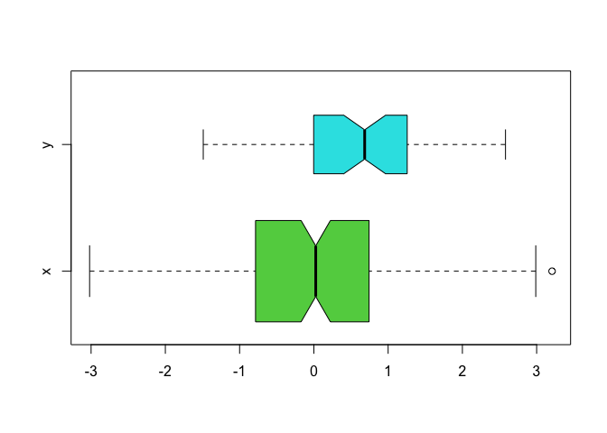<!-- -->

以 **datasets** 包中的杀虫剂数据 `InsectSprays` 为例。该数据有两列，第一列为昆虫数目，第二列为杀虫剂种类（ABCDEF）

```r
data(InsectSprays, package = "datasets")
par(mfrow = c(1, 2))
boxplot(count ~ spray, data = InsectSprays,
        col = "lightgray", horizontal = TRUE, pch = 4)
boxplot(count ~ spray, data = InsectSprays,
        col = "red", horizontal = FALSE, pch = 10)
```

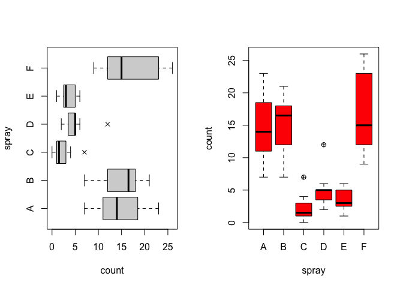<!-- -->

以60只豚鼠成牙细胞(负责牙齿生长的细胞)的长度数据为例，该数据第一列为牙齿长度，第二列为药物种类，第三列为剂量。

```r
data(ToothGrowth, package = "datasets")
boxplot(len ~ dose, data = ToothGrowth, at = 1:3 - 0.2, boxwex = 0.25,
        subset = supp=="VC", col = "blue", 
        main = "Guinea Pigs' Tooth Growth", 
        xlab = "Vitamin C dose/mg", ylab = "tooth length",
        ylim = c(0, 35))
boxplot(len ~ dose, data = ToothGrowth, add = TRUE, at = 1:3 + 0.2, 
        boxwex = 0.25, subset = supp=="OJ", col="red") 
legend(2, 9, c("VC (Ascorbic acid)", "OJ (Orange juice)"), fill = c("blue", "red"))
```

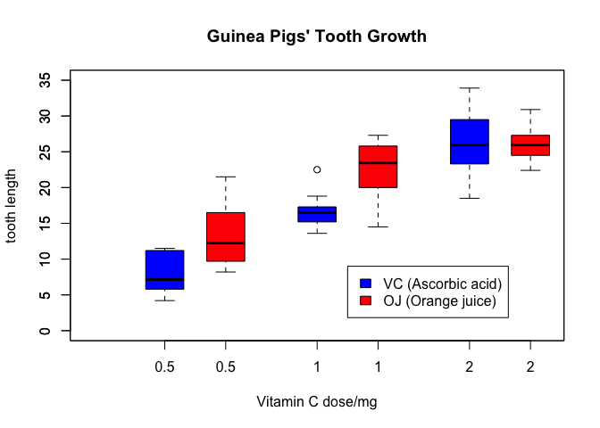<!-- -->

## 一元函数图

```r
x <- iris$Petal.Length
y <- iris$Petal.Width
d <- data.frame(x = x, y = y)
plot(d$x, d$y, xlab = "Petal Length",ylab = "Petal Width", pch = 19, cex = 1.3, col = 'gray')
grid(col = "grey60") # 添加网格线
axis(side = 4, lty = 1) # 添加坐标轴
points(mean(d$x), mean(d$y), pch = 19, cex = 2, col = 'red') # 添加均值点
abline(v = mean(d$x), lty = 2, col = "gray30") # 添加均值垂直线（虚线）
abline(h = mean(d$y), lty = 1, col = "gray30") # 添加均值水平线（实线）
abline(lm(d$y ~ d$x), lwd = 2, col = 'blue') # 添加回归直线
fit <- lm(d$y ~ d$x)                                                            
d$predicted <- predict(fit) # 保存预测值
d$residuals <- residuals(fit) # 保存残差
segments(d$x, d$y, d$x, d$predicted) # 添加实际值与预测值的连线
arrows(d$x[55], d$y[55]-0.1, d$x[53], d$y[53] - 0.7, code = 2, angle = 25, length = 0.06, col = 'black', lwd = 2) # 添加带箭头的线段
text(d$x[53], d$y[53] - 0.8, expression(hat(epsilon[i]) == y[i] - hat(beta)[0] + hat(beta)[1]*x[i])) # 添加文本
arrows(d$x[30], d$y[30], d$x[32], d$y[32] + 0.5, code = 2, angle = 25, length = 0.06, col = 'blue', lwd = 2) # 添加带箭头的线段
text(d$x[32], d$y[32] + 0.6, expression(hat(y) == hat(beta)[0] + hat(beta)[1]*x)) # 添加文本
legend("topleft", legend = c("Regression Line", "Residual Error"), 
       lty = c(1,6), col = c("blue", "black"),
       cex = 0.95, fill = c("blue", "black"), box.col = "grey", ncol = 1, inset = 0.01, x.intersp = 0.3) # 添加图例
box(col = "black", lwd = 2)
```

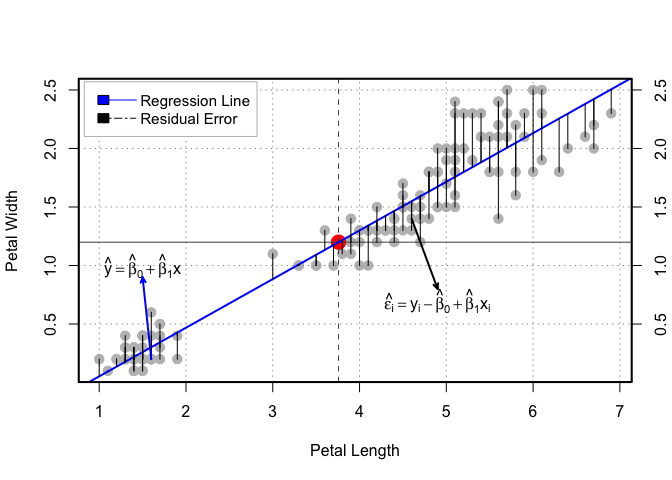<!-- -->

# 应用练习
## 案例1：Analysis of Nobel Prize Laureates
- 数据集地址：[nobel_winners.csv](https://github.com/rfordatascience/tidytuesday/blob/master/data/2019/2019-05-14/nobel_winners.csv)

### 数据清理

```r
library(tidyverse) # 数据清理、整合以及可视化一站式服务，Human Freindly!
library(lubridate) # 为了处理日期

## 读取数据
# 如果是xlsx格式
# readxl::read_excel("myfile.xlsx")
# 如果是csv格式
# readr::read_csv("myfile.csv")

nobel_winners <- read.csv("/Users/shihongwei/Desktop/2021秋季助教_多元/上机课/lec01/datasets/nobel_winners.csv")

## 查看缺失值
sum_of_na <- function(x){
  sum(is.na(x))
}
nobel_winners$motivation %>% sum_of_na() # 查看某一列
```

```
## [1] 88
```

```r
nobel_winners %>% summarise(across(everything(), sum_of_na)) 
```

<div data-pagedtable="false">
  <script data-pagedtable-source type="application/json">
{"columns":[{"label":["prize_year"],"name":[1],"type":["int"],"align":["right"]},{"label":["category"],"name":[2],"type":["int"],"align":["right"]},{"label":["prize"],"name":[3],"type":["int"],"align":["right"]},{"label":["motivation"],"name":[4],"type":["int"],"align":["right"]},{"label":["prize_share"],"name":[5],"type":["int"],"align":["right"]},{"label":["laureate_id"],"name":[6],"type":["int"],"align":["right"]},{"label":["laureate_type"],"name":[7],"type":["int"],"align":["right"]},{"label":["full_name"],"name":[8],"type":["int"],"align":["right"]},{"label":["birth_date"],"name":[9],"type":["int"],"align":["right"]},{"label":["birth_city"],"name":[10],"type":["int"],"align":["right"]},{"label":["birth_country"],"name":[11],"type":["int"],"align":["right"]},{"label":["gender"],"name":[12],"type":["int"],"align":["right"]},{"label":["organization_name"],"name":[13],"type":["int"],"align":["right"]},{"label":["organization_city"],"name":[14],"type":["int"],"align":["right"]},{"label":["organization_country"],"name":[15],"type":["int"],"align":["right"]},{"label":["death_date"],"name":[16],"type":["int"],"align":["right"]},{"label":["death_city"],"name":[17],"type":["int"],"align":["right"]},{"label":["death_country"],"name":[18],"type":["int"],"align":["right"]}],"data":[{"1":"0","2":"0","3":"0","4":"88","5":"0","6":"0","7":"0","8":"0","9":"31","10":"28","11":"26","12":"26","13":"247","14":"253","15":"253","16":"352","17":"370","18":"364"}],"options":{"columns":{"min":{},"max":[10]},"rows":{"min":[10],"max":[10]},"pages":{}}}
  </script>
</div>

```r
nobel_winners %>% map_df(~sum(is.na(.))) # 一次行查看所有列
```

<div data-pagedtable="false">
  <script data-pagedtable-source type="application/json">
{"columns":[{"label":["prize_year"],"name":[1],"type":["int"],"align":["right"]},{"label":["category"],"name":[2],"type":["int"],"align":["right"]},{"label":["prize"],"name":[3],"type":["int"],"align":["right"]},{"label":["motivation"],"name":[4],"type":["int"],"align":["right"]},{"label":["prize_share"],"name":[5],"type":["int"],"align":["right"]},{"label":["laureate_id"],"name":[6],"type":["int"],"align":["right"]},{"label":["laureate_type"],"name":[7],"type":["int"],"align":["right"]},{"label":["full_name"],"name":[8],"type":["int"],"align":["right"]},{"label":["birth_date"],"name":[9],"type":["int"],"align":["right"]},{"label":["birth_city"],"name":[10],"type":["int"],"align":["right"]},{"label":["birth_country"],"name":[11],"type":["int"],"align":["right"]},{"label":["gender"],"name":[12],"type":["int"],"align":["right"]},{"label":["organization_name"],"name":[13],"type":["int"],"align":["right"]},{"label":["organization_city"],"name":[14],"type":["int"],"align":["right"]},{"label":["organization_country"],"name":[15],"type":["int"],"align":["right"]},{"label":["death_date"],"name":[16],"type":["int"],"align":["right"]},{"label":["death_city"],"name":[17],"type":["int"],"align":["right"]},{"label":["death_country"],"name":[18],"type":["int"],"align":["right"]}],"data":[{"1":"0","2":"0","3":"0","4":"88","5":"0","6":"0","7":"0","8":"0","9":"31","10":"28","11":"26","12":"26","13":"247","14":"253","15":"253","16":"352","17":"370","18":"364"}],"options":{"columns":{"min":{},"max":[10]},"rows":{"min":[10],"max":[10]},"pages":{}}}
  </script>
</div>

```r
nobel_winners <- nobel_winners %>% # 管道操作符
  mutate_if(is.character, tolower) %>% # 字母都变成小写
  # 根据指定的列删除重复的行
  distinct_at(vars(full_name, prize_year, category), .keep_all = TRUE) %>% 
  mutate(prize_decade = as.factor(10*(prize_year%/%10)),
         prize_age = prize_year-year(birth_date),
         birth_decade = 10*floor(year(birth_date)/10))

## 查看数据
head(nobel_winners, 10)
```

<div data-pagedtable="false">
  <script data-pagedtable-source type="application/json">
{"columns":[{"label":[""],"name":["_rn_"],"type":[""],"align":["left"]},{"label":["prize_year"],"name":[1],"type":["int"],"align":["right"]},{"label":["category"],"name":[2],"type":["chr"],"align":["left"]},{"label":["prize"],"name":[3],"type":["chr"],"align":["left"]},{"label":["motivation"],"name":[4],"type":["chr"],"align":["left"]},{"label":["prize_share"],"name":[5],"type":["chr"],"align":["left"]},{"label":["laureate_id"],"name":[6],"type":["int"],"align":["right"]},{"label":["laureate_type"],"name":[7],"type":["chr"],"align":["left"]},{"label":["full_name"],"name":[8],"type":["chr"],"align":["left"]},{"label":["birth_date"],"name":[9],"type":["chr"],"align":["left"]},{"label":["birth_city"],"name":[10],"type":["chr"],"align":["left"]},{"label":["birth_country"],"name":[11],"type":["chr"],"align":["left"]},{"label":["gender"],"name":[12],"type":["chr"],"align":["left"]},{"label":["organization_name"],"name":[13],"type":["chr"],"align":["left"]},{"label":["organization_city"],"name":[14],"type":["chr"],"align":["left"]},{"label":["organization_country"],"name":[15],"type":["chr"],"align":["left"]},{"label":["death_date"],"name":[16],"type":["chr"],"align":["left"]},{"label":["death_city"],"name":[17],"type":["chr"],"align":["left"]},{"label":["death_country"],"name":[18],"type":["chr"],"align":["left"]},{"label":["prize_decade"],"name":[19],"type":["fct"],"align":["left"]},{"label":["prize_age"],"name":[20],"type":["dbl"],"align":["right"]},{"label":["birth_decade"],"name":[21],"type":["dbl"],"align":["right"]}],"data":[{"1":"1901","2":"chemistry","3":"the nobel prize in chemistry 1901","4":"\"in recognition of the extraordinary services he has rendered by the discovery of the laws of chemical dynamics and osmotic pressure in solutions\"","5":"1/1","6":"160","7":"individual","8":"jacobus henricus van 't hoff","9":"1852-08-30","10":"rotterdam","11":"netherlands","12":"male","13":"berlin university","14":"berlin","15":"germany","16":"1911-03-01","17":"berlin","18":"germany","19":"1900","20":"49","21":"1850","_rn_":"1"},{"1":"1901","2":"literature","3":"the nobel prize in literature 1901","4":"\"in special recognition of his poetic composition, which gives evidence of lofty idealism, artistic perfection and a rare combination of the qualities of both heart and intellect\"","5":"1/1","6":"569","7":"individual","8":"sully prudhomme","9":"1839-03-16","10":"paris","11":"france","12":"male","13":"NA","14":"NA","15":"NA","16":"1907-09-07","17":"châtenay","18":"france","19":"1900","20":"62","21":"1830","_rn_":"2"},{"1":"1901","2":"medicine","3":"the nobel prize in physiology or medicine 1901","4":"\"for his work on serum therapy, especially its application against diphtheria, by which he has opened a new road in the domain of medical science and thereby placed in the hands of the physician a victorious weapon against illness and deaths\"","5":"1/1","6":"293","7":"individual","8":"emil adolf von behring","9":"1854-03-15","10":"hansdorf (lawice)","11":"prussia (poland)","12":"male","13":"marburg university","14":"marburg","15":"germany","16":"1917-03-31","17":"marburg","18":"germany","19":"1900","20":"47","21":"1850","_rn_":"3"},{"1":"1901","2":"peace","3":"the nobel peace prize 1901","4":"NA","5":"1/2","6":"462","7":"individual","8":"jean henry dunant","9":"1828-05-08","10":"geneva","11":"switzerland","12":"male","13":"NA","14":"NA","15":"NA","16":"1910-10-30","17":"heiden","18":"switzerland","19":"1900","20":"73","21":"1820","_rn_":"4"},{"1":"1901","2":"peace","3":"the nobel peace prize 1901","4":"NA","5":"1/2","6":"463","7":"individual","8":"frédéric passy","9":"1822-05-20","10":"paris","11":"france","12":"male","13":"NA","14":"NA","15":"NA","16":"1912-06-12","17":"paris","18":"france","19":"1900","20":"79","21":"1820","_rn_":"5"},{"1":"1901","2":"physics","3":"the nobel prize in physics 1901","4":"\"in recognition of the extraordinary services he has rendered by the discovery of the remarkable rays subsequently named after him\"","5":"1/1","6":"1","7":"individual","8":"wilhelm conrad röntgen","9":"1845-03-27","10":"lennep (remscheid)","11":"prussia (germany)","12":"male","13":"munich university","14":"munich","15":"germany","16":"1923-02-10","17":"munich","18":"germany","19":"1900","20":"56","21":"1840","_rn_":"6"},{"1":"1902","2":"chemistry","3":"the nobel prize in chemistry 1902","4":"\"in recognition of the extraordinary services he has rendered by his work on sugar and purine syntheses\"","5":"1/1","6":"161","7":"individual","8":"hermann emil fischer","9":"1852-10-09","10":"euskirchen","11":"prussia (germany)","12":"male","13":"berlin university","14":"berlin","15":"germany","16":"1919-07-15","17":"berlin","18":"germany","19":"1900","20":"50","21":"1850","_rn_":"7"},{"1":"1902","2":"literature","3":"the nobel prize in literature 1902","4":"\"the greatest living master of the art of historical writing, with special reference to his monumental work, <i>a history of rome<\/i>\"","5":"1/1","6":"571","7":"individual","8":"christian matthias theodor mommsen","9":"1817-11-30","10":"garding","11":"schleswig (germany)","12":"male","13":"NA","14":"NA","15":"NA","16":"1903-11-01","17":"charlottenburg","18":"germany","19":"1900","20":"85","21":"1810","_rn_":"8"},{"1":"1902","2":"medicine","3":"the nobel prize in physiology or medicine 1902","4":"\"for his work on malaria, by which he has shown how it enters the organism and thereby has laid the foundation for successful research on this disease and methods of combating it\"","5":"1/1","6":"294","7":"individual","8":"ronald ross","9":"1857-05-13","10":"almora","11":"india","12":"male","13":"university college","14":"liverpool","15":"united kingdom","16":"1932-09-16","17":"putney heath","18":"united kingdom","19":"1900","20":"45","21":"1850","_rn_":"9"},{"1":"1902","2":"peace","3":"the nobel peace prize 1902","4":"NA","5":"1/2","6":"464","7":"individual","8":"élie ducommun","9":"1833-02-19","10":"geneva","11":"switzerland","12":"male","13":"NA","14":"NA","15":"NA","16":"1906-12-07","17":"bern","18":"switzerland","19":"1900","20":"69","21":"1830","_rn_":"10"}],"options":{"columns":{"min":{},"max":[10]},"rows":{"min":[10],"max":[10]},"pages":{}}}
  </script>
</div>

<div class="centered">

</div>
